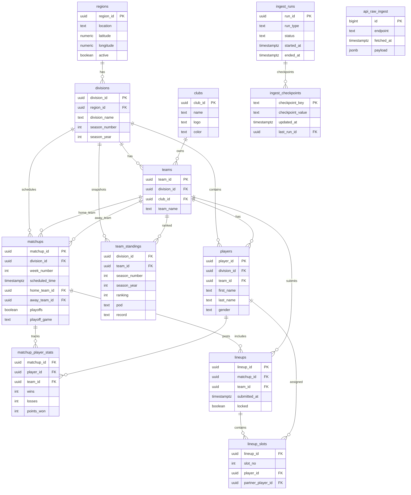

# Cross Club Schema ERD (v1)

```mermaid
erDiagram
  regions ||--o{ divisions : has
  divisions ||--o{ teams : has
  divisions ||--o{ players : contains
  clubs ||--o{ teams : owns
  teams ||--o{ players : has
  divisions ||--o{ team_standings : snapshots
  teams ||--o{ team_standings : ranked
  divisions ||--o{ matchups : schedules
  teams ||--o{ matchups : home_team
  teams ||--o{ matchups : away_team
  matchups ||--o{ matchup_player_stats : tracks
  players ||--o{ matchup_player_stats : posts
  matchups ||--o{ lineups : includes
  teams ||--o{ lineups : submits
  lineups ||--o{ lineup_slots : contains
  players ||--o{ lineup_slots : assigned
  ingest_runs ||--o{ ingest_checkpoints : checkpoints

  regions {
    uuid region_id PK
    text location
    numeric latitude
    numeric longitude
    boolean active
  }

  divisions {
    uuid division_id PK
    uuid region_id FK
    text division_name
    int season_number
    int season_year
  }

  clubs {
    uuid club_id PK
    text name
    text logo
    text color
  }

  teams {
    uuid team_id PK
    uuid division_id FK
    uuid club_id FK
    text team_name
  }

  players {
    uuid player_id PK
    uuid division_id FK
    uuid team_id FK
    text first_name
    text last_name
    text gender
  }

  team_standings {
    uuid division_id FK
    uuid team_id FK
    int season_number
    int season_year
    int ranking
    text pod
    text record
  }

  matchups {
    uuid matchup_id PK
    uuid division_id FK
    int week_number
    timestamptz scheduled_time
    uuid home_team_id FK
    uuid away_team_id FK
    boolean playoffs
    text playoff_game
  }

  matchup_player_stats {
    uuid matchup_id FK
    uuid player_id FK
    uuid team_id FK
    int wins
    int losses
    int points_won
  }

  lineups {
    uuid lineup_id PK
    uuid matchup_id FK
    uuid team_id FK
    timestamptz submitted_at
    boolean locked
  }

  lineup_slots {
    uuid lineup_id FK
    int slot_no
    uuid player_id FK
    uuid partner_player_id FK
  }

  api_raw_ingest {
    bigint id PK
    text endpoint
    timestamptz fetched_at
    jsonb payload
  }

  ingest_runs {
    uuid run_id PK
    text run_type
    text status
    timestamptz started_at
    timestamptz ended_at
  }

  ingest_checkpoints {
    text checkpoint_key PK
    text checkpoint_value
    timestamptz updated_at
    uuid last_run_id FK
  }
```
