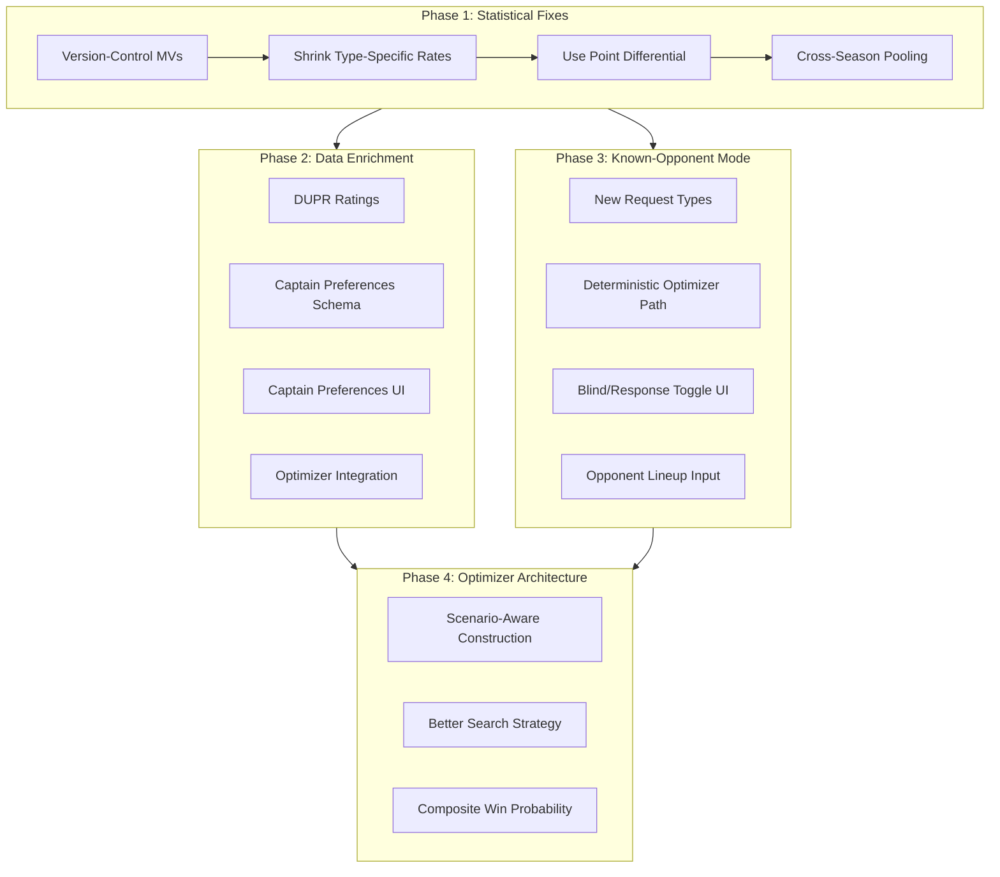
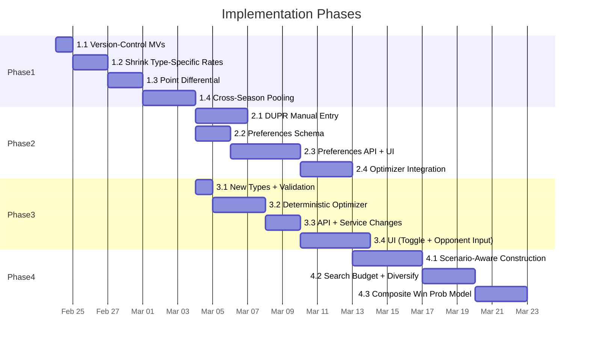

# Lineup Lab Improvement Plan

## Overview

A phased plan to fix statistical weaknesses, add new data sources (DUPR, captain preferences), implement known-opponent mode, and improve the optimizer algorithm -- ordered so each phase ships independent value.

## Architecture Overview



---

## Phase 1: Statistical Foundation Fixes

No UI changes. All DB-side and optimizer-side. Ship independently.

### Step 1.1 -- Version-Control All Analytics Objects

Create migration files for every analytics object currently living only in the DB:

- `mv_game_events_canonical` (materialized view)
- `mv_team_game_pairs` (materialized view)
- `mv_pair_baseline_features` (materialized view)
- `mv_pair_vs_pair_features` (materialized view)
- `mv_opponent_pairing_scenarios` (materialized view)
- `fn_lineup_lab_feature_bundle` (function)

Each MV gets a `CREATE MATERIALIZED VIEW IF NOT EXISTS` in a migration. The thin `vw_` wrapper views should also be included. Add a `REFRESH MATERIALIZED VIEW` comment or companion function.

Files to create:

- `supabase/migrations/YYYYMMDD_version_control_analytics_mvs.sql`

### Step 1.2 -- Shrink Type-Specific Win Rates

**Problem**: `mixed_win_rate`, `female_win_rate`, `male_win_rate` in `mv_pair_baseline_features` are raw averages (no shrinkage). With ~3 games average per type, these are noisy.

**Change in `mv_pair_baseline_features`**: Add type-specific priors and shrink:

```sql
-- In the division_priors CTE, add type-specific priors:
division_type_priors AS (
  SELECT division_id, season_year, season_number, match_type,
    avg(CASE WHEN won_game THEN 1.0 ELSE 0.0 END)::numeric(10,6) AS type_prior
  FROM base
  GROUP BY division_id, season_year, season_number, match_type
)

-- In the final SELECT, replace raw rates with shrunk:
(mixed_wins + 6.0 * dtp_mixed.type_prior) / NULLIF(mixed_games + 6.0, 0) AS mixed_win_rate_shrunk,
(female_wins + 6.0 * dtp_female.type_prior) / NULLIF(female_games + 6.0, 0) AS female_win_rate_shrunk,
(male_wins + 6.0 * dtp_male.type_prior) / NULLIF(male_games + 6.0, 0) AS male_win_rate_shrunk,
```

Pseudo-count of 6 for type-specific (less than 8 for overall, since type-specific priors are already more specific).

**Change in `fn_lineup_lab_feature_bundle`**: Return the new `_shrunk` columns instead of the raw rates.

**Change in `worker/src/runtime/lineupLab/optimizer.ts`**: `getTypeSpecificRate()` should read the shrunk columns. Update `BundleCandidatePair` type to add `mixed_win_rate_shrunk`, `female_win_rate_shrunk`, `male_win_rate_shrunk`.

Migration file: `supabase/migrations/YYYYMMDD_shrink_type_specific_rates.sql`

### Step 1.3 -- Incorporate Point Differential

**Calibration**: From 24,979 games, stddev(margin) = 6.49. Using the standard logistic calibration, `scale = stddev / 1.7 ~ 3.8`. Use `scale = 4.0` as a round starting point.

**Change in `mv_pair_baseline_features`**: Add computed column:

```sql
(1.0 / (1.0 + exp(-avg_point_diff / 4.0)))::numeric(10,6) AS pd_win_probability
```

Also add type-specific versions: `mixed_pd_win_probability`, `female_pd_win_probability`, `male_pd_win_probability` from their respective `avg_point_diff` values.

**Change in `mv_pair_vs_pair_features`**: Same logistic transform on the h2h avg_point_diff.

**Change in `worker/src/runtime/lineupLab/optimizer.ts`**: The `buildContext` function should compute an `effectiveWinRate` that blends shrunk win rate with point-diff probability weighted by reliability:

```typescript
const effectiveRate = reliability * winRateShrunk + (1 - reliability) * pdWinProbability;
```

At high reliability (many games), trust the observed win rate. At low reliability, lean on point differential.

Migration file: `supabase/migrations/YYYYMMDD_add_point_diff_win_probability.sql`

### Step 1.4 -- Cross-Season Data Pooling

**Change in `mv_team_game_pairs`**: Currently scoped to one season via the join to `divisions`. Expand to include prior seasons with a decay weight column:

```sql
CASE
  WHEN d.season_year = current_year AND d.season_number = current_season THEN 1.0
  WHEN d.season_year = current_year AND d.season_number = current_season - 1 THEN 0.5
  ELSE 0.25
END AS season_weight
```

**Change in `mv_pair_baseline_features`**: Use weighted averages instead of raw averages. `wins` becomes `sum(won_game::int * season_weight)`, `games_played` becomes `sum(season_weight)`, etc. The shrinkage formula stays the same but now operates on effectively larger sample sizes.

**Scope consideration**: Only pool within the same division. Cross-division pooling would mix skill levels.

Migration file: `supabase/migrations/YYYYMMDD_cross_season_data_pooling.sql`

---

## Phase 2: Data Enrichment

### Step 2.1 -- DUPR Ratings Manual Entry

**DB**: `players.dupr_rating` already exists as `numeric`. No schema change needed. Add an `updated_at` trigger or manual timestamp so the optimizer knows recency.

**New API endpoint**: `PUT /api/lineup-lab/context/player-dupr` -- accepts `{ playerId, duprRating }`. Captain-only access.

**Worker changes**:

- New handler in `worker/src/runtime/lineupLab/contextHandler.ts`
- New repository function in `worker/src/runtime/lineupLab/repository.ts`: `updatePlayerDupr(env, playerId, rating)`

**Feature bundle change**: `players_catalog` in `fn_lineup_lab_feature_bundle` already returns `player_id` -- add `dupr_rating` to the SELECT.

**UI**: In `src/features/chat/components/ChatSidebar.vue`, add a collapsible "Player Ratings" section below the matchup selector. Show each available player with an editable DUPR input field.

### Step 2.2 -- Captain Preferences Schema

**New tables**:

```sql
CREATE TABLE public.player_lineup_preferences (
  player_id              uuid NOT NULL REFERENCES players(player_id),
  team_id                uuid NOT NULL,
  division_id            uuid NOT NULL REFERENCES divisions(division_id),
  season_year            integer NOT NULL,
  season_number          integer NOT NULL,
  preferred_side_mixed   text CHECK (preferred_side_mixed IN ('left', 'right', 'either')),
  preferred_side_gendered text CHECK (preferred_side_gendered IN ('left', 'right', 'either')),
  updated_at             timestamptz NOT NULL DEFAULT now(),
  PRIMARY KEY (player_id, team_id, division_id, season_year, season_number)
);

CREATE TABLE public.player_partner_preferences (
  player_id           uuid NOT NULL REFERENCES players(player_id),
  preferred_partner_id uuid NOT NULL REFERENCES players(player_id),
  team_id             uuid NOT NULL,
  division_id         uuid NOT NULL REFERENCES divisions(division_id),
  season_year         integer NOT NULL,
  season_number       integer NOT NULL,
  preference_strength numeric(3,2) DEFAULT 1.0,
  updated_at          timestamptz NOT NULL DEFAULT now(),
  PRIMARY KEY (player_id, preferred_partner_id, team_id, division_id, season_year, season_number),
  CHECK (player_id <> preferred_partner_id)
);
```

Enable RLS on both tables. Migration: `supabase/migrations/YYYYMMDD_captain_preferences_schema.sql`

### Step 2.3 -- Captain Preferences API + UI

**New API endpoints**:

- `GET /api/lineup-lab/context/preferences?teamId=X&divisionId=Y&seasonYear=Z&seasonNumber=W`
- `PUT /api/lineup-lab/context/preferences` -- upsert side preferences and partner preferences

**Worker**: New handlers + repository functions in the lineupLab module.

**Feature bundle change**: `fn_lineup_lab_feature_bundle` should include a `preferences` key in the output JSON, containing side prefs and partner prefs for available players.

**UI in `src/features/chat/components/ChatSidebar.vue`**:

- New expandable "Player Preferences" section
- Per-player: side selector dropdown for mixed rounds (left/right/either)
- Per-player: side selector dropdown for gendered rounds (left/right/either)
- Per-player: multi-select for preferred partners from the roster
- Save button that calls the PUT endpoint

### Step 2.4 -- Optimizer Integration of New Data

**Side compatibility in `worker/src/runtime/lineupLab/optimizer.ts`**:

- When scoring a pair, use the round-appropriate side preference: `preferred_side_mixed` for mixed rounds, `preferred_side_gendered` for male/female rounds.
- Check if one player prefers left and the other prefers right for that round type. This is the ideal complementary pairing.
- Scoring adjustment in `getPairScore` (or its replacement):
  - Both prefer the same side (for the current round type): `-0.02` penalty
  - One left + one right (for the current round type): `+0.02` bonus
  - Either/unknown: no adjustment

**Partner preference boost**:

- If a pair is marked as preferred by either player, apply a soft boost: `+0.03` to their pair score
- This is deliberately smaller than a meaningful win-rate difference, so the optimizer only uses it as a tiebreaker, not to override clear statistical signal

**DUPR-based priors for unseen pairs**:

- For pairs with zero historical games together, estimate a prior win rate from their combined DUPR:

```typescript
const pairDupr = (duprA + duprB) / 2;
const divisionAvgDupr = ...; // from players_catalog
const duprDelta = pairDupr - divisionAvgDupr;
const duprPrior = 1 / (1 + Math.exp(-duprDelta / DUPR_SCALE));
```

- This replaces the flat 0.5 prior for pairs with no data

---

## Phase 3: Known-Opponent Mode

### Step 3.1 -- New Types and Validation

**In `worker/src/runtime/lineupLab/types.ts`**:

```typescript
export type LineupLabMode = "blind" | "known_opponent";

export interface KnownOpponentRound {
  roundNumber: number;
  games: Array<{
    slotNumber: number;
    matchType: LineupMatchType;
    playerAId: string;
    playerBId: string;
  }>;
}

export interface LineupLabRecommendRequest {
  // ... existing fields ...
  mode: LineupLabMode;
  opponentRounds?: KnownOpponentRound[]; // required when mode === "known_opponent"
}
```

**In `worker/src/runtime/lineupLab/validation.ts`**: Add validation for `mode` field. When `mode === "known_opponent"`, validate that `opponentRounds` has 8 rounds, 4 games each, all player IDs are valid UUIDs, match types follow the alternating pattern.

### Step 3.2 -- Deterministic Optimizer Path

**In `worker/src/runtime/lineupLab/optimizer.ts`**: New function `recommendPairSetsKnownOpponent()`:

- Receives the known opponent rounds instead of scenarios
- Schedule construction is the same (greedy backtracking)
- Scoring is simpler: for each of our games, look up the direct pair-vs-pair matchup against the known opponent pair in that slot
- No scenario weighting -- each game has a single deterministic opponent
- Expected wins = sum of individual game win probabilities
- Volatility comes only from estimation uncertainty, not opponent lineup uncertainty

The `getPairScore` heuristic (or its Phase 4 replacement) should directly score against the known opponent pair for that slot during construction, not just in post-hoc evaluation.

### Step 3.3 -- API and Service Changes

**In `worker/src/runtime/lineupLab/handler.ts`**: Route based on `mode`:

- `blind` --> existing `runLineupLabRecommend` flow
- `known_opponent` --> new `runLineupLabRecommendKnown` flow

**In `worker/src/runtime/lineupLab/service.ts`**: New `runLineupLabRecommendKnown()` that fetches the feature bundle (still need pair baselines and h2h data), then calls the deterministic optimizer.

**In `worker/src/runtime/lineupLab/repository.ts`**: `fetchLineupLabFeatureBundle` can skip the `scenarios` CTE when in known-opponent mode. Add an optional flag to the function or create a slimmer bundle fetch.

### Step 3.4 -- UI Changes

**In `src/features/chat/components/ChatSidebar.vue`**:

- Add a toggle below the matchup selector: "Blind Lineup" / "Response to Opponent"
- When "Response" is selected, show the opponent lineup input form

**New component `OpponentLineupInput.vue`**:

- 8 rounds displayed in alternating mixed/gendered pattern
- 4 game slots per round with player name inputs (autocomplete from opponent roster)
- Pre-populate from the selected matchup's away team roster
- Validate completeness before allowing "Calculate Pairings"

**In `src/features/chat/components/ChatShell.vue` and `src/App.vue`**: Wire the mode state and opponent rounds through to the lineup lab client.

**In `src/features/chat/lineupLabClient.ts`**: Update `recommend()` to include `mode` and `opponentRounds` in the POST body.

---

## Phase 4: Optimizer Architecture Improvements

### Step 4.1 -- Scenario-Aware Schedule Construction

**Replace `getPairScore` in `worker/src/runtime/lineupLab/optimizer.ts`**:

Instead of the ad-hoc heuristic, score each candidate pair for a slot by its expected win contribution across the scenario distribution:

```typescript
const getSlotExpectedWins = (
  pair: PairRecord,
  slotType: LineupMatchType,
  scenarios: OpponentScenarioPrepared[],
  context: BuildContext,
): number => {
  let expectedWin = 0;
  for (const scenario of scenarios) {
    const oppPairs = scenario.byType[slotType];
    // weight by scenario probability and opponent pair weights
    const matchupValue = evaluateAgainstOpponentPairs(pair, oppPairs, context);
    expectedWin += matchupValue * scenario.weight;
  }
  return expectedWin;
};
```

This is more expensive per evaluation (~12 scenarios x ~3 opponent pairs = ~36 lookups per candidate) but produces dramatically better schedules because it uses the same scoring during construction and evaluation.

Keep the fatigue penalty and repeat-pair penalty as soft adjustments, but remove the random noise and the arbitrary reliability bonus.

### Step 4.2 -- Increase Search Budget + Diversify

- Increase `MAX_ATTEMPTS` from 180 to 500
- Add diversity: use a two-phase approach
  - Phase A (300 attempts): greedy construction with scenario-aware scoring
  - Phase B (200 attempts): take the top 10 schedules from Phase A and apply local search (swap one pair between two rounds, re-evaluate)
- This gives you both breadth (many starting points) and depth (local optimization of promising candidates)
- Monitor runtime: with scenario-aware scoring, each attempt is ~10x more expensive. Profile and adjust budget accordingly.

### Step 4.3 -- Composite Win Probability Model

Build a unified probability estimation function that layers all signals:

```typescript
const estimatePairWinProbability = (
  pair: PairRecord,
  matchType: LineupMatchType,
  opponentPair: OpponentPair | null,
  context: BuildContext,
): number => {
  // Layer 1: DUPR-based prior (when available)
  const duprPrior = getDuprBasedPrior(pair, opponentPair, context);

  // Layer 2: Point-diff-based estimate (from baseline features)
  const pdEstimate = pair.pdWinProbability;

  // Layer 3: Shrunk win rate (from observed W/L)
  const shrunkRate = pair.typeSpecificShrunkRate[matchType] ?? pair.baseWinRate;

  // Layer 4: Head-to-head rate (if opponent known and h2h data exists)
  const h2hRate = opponentPair ? getH2HRate(pair, opponentPair, context) : null;

  // Blend by reliability: more data = more weight on observed rates
  // Less data = more weight on priors (DUPR, point diff)
  return blendByReliability(duprPrior, pdEstimate, shrunkRate, h2hRate, pair.reliability);
};
```

---

## Dependency Graph and Estimated Effort



**Phase 1**: ~8 days -- ships first, immediately improves recommendations
**Phase 2**: ~12 days -- runs partially parallel with Phase 3
**Phase 3**: ~10 days -- can start as soon as Phase 1 completes
**Phase 4**: ~10 days -- depends on Phase 2 (needs DUPR data in the model)

---

## Testing Strategy

Each phase should include:

- **Unit tests**: Extend `tests/lineup-lab-optimizer.test.ts` with cases for new scoring logic, known-opponent mode, composite model
- **Integration tests**: Extend `tests/lineup-lab-handler.test.ts` for new endpoints and mode routing
- **Data validation**: After each MV migration, run comparison queries to verify the new MVs produce sensible output vs the old ones
- **A/B comparison**: For Phase 4, run both old and new optimizer on the same inputs and compare recommendation quality before switching over
