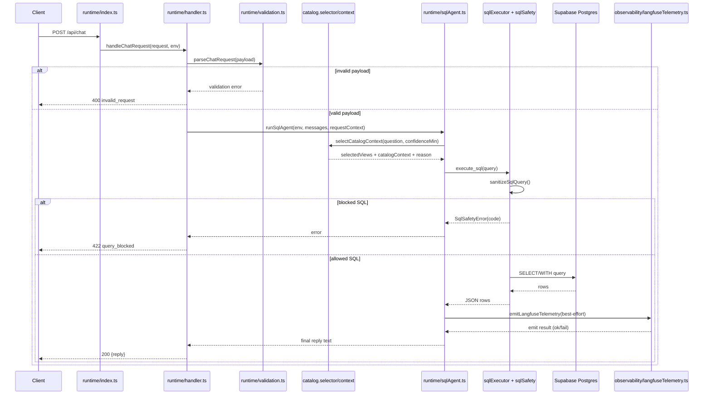
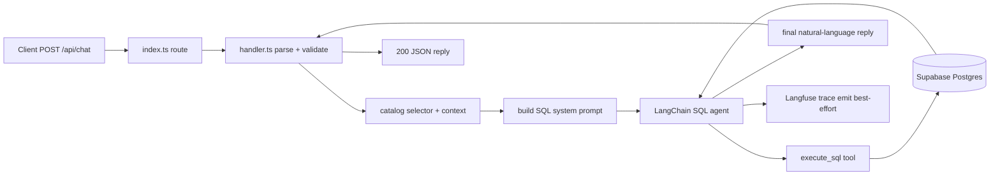

# Chat Request Lifecycle

This document describes the live runtime path for `POST /api/chat` and where to debug each class of failure.

## Request Path

1. `worker/src/runtime/index.ts` routes `POST /api/chat`.
2. `worker/src/runtime/handler.ts` parses JSON, validates shape, creates `RequestContext`, maps errors to HTTP status.
3. `worker/src/runtime/sqlAgent.ts` selects catalog context, builds system prompt, invokes model + SQL tool.
4. `worker/src/runtime/sql/sqlExecutor.ts` sanitizes query and executes read-only SQL.
5. `worker/src/observability/langfuseTelemetry.ts` emits best-effort Langfuse trace.

## Sequence Diagram

## Happy Path Flowchart

## Error Mapping

- `400 invalid_json`: body is not parseable JSON.
- `400 invalid_request`: payload shape fails validation (`messages` invalid).
- `422 query_blocked`: typed SQL safety violation (`SqlSafetyError`).
- `500 chat_failed`: model/tool/runtime error outside SQL safety.
- `500 misconfigured_env`: required runtime env not present.

## Debugging Guide

- Input validation issues:
  - `worker/src/runtime/validation.ts`
- SQL blocked unexpectedly:
  - `worker/src/runtime/sql/sqlSafety.ts`
  - `worker/src/runtime/sql/sqlErrors.ts`
- Wrong view selection/prompt context:
  - `worker/src/runtime/catalog/catalog.selector.ts`
  - `worker/src/runtime/catalog/catalog.context.ts`
  - `worker/src/runtime/catalog/catalog.data.ts`
- Telemetry missing:
  - `worker/src/observability/langfuseTelemetry.ts`
  - Check warning logs with `message = "langfuse_emit_failed"` and `requestId`.
